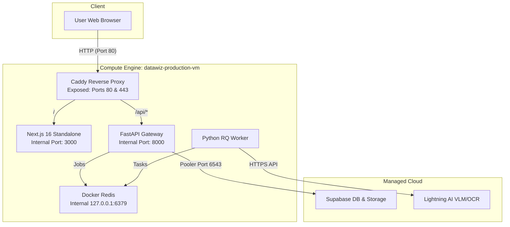

# Strategy 1: Local Terminal & CLI Automated GCP Deployment

This guide documents the automated production deployment of the **DataWiz Digital Archive System** executed directly from a local Windows PowerShell terminal using the Google Cloud SDK (`gcloud`).

---

## 1. Overview & Architecture

This deployment model provisions a single Compute Engine Virtual Machine (`e2-standard-2`, Ubuntu 22.04 LTS) and configures a co-located multi-service system protected by a **Caddy Reverse Proxy**.



---

## 2. Prerequisites

1. **Google Cloud SDK**: Installed on your local machine (`winget install Google.CloudSDK`).
2. **GCP Account & Project**: Active project ID `archivingproj01` with billing enabled.
3. **Authentication**: Run `gcloud auth login` in your terminal to authenticate your browser.

---

## 3. How to Execute Deployment

Open Windows PowerShell in the root repository directory and execute:

```powershell
powershell.exe -ExecutionPolicy Bypass -File .\deployment\local_cli_automation\deploy-gcp.ps1
```

---

## 4. What `deploy-gcp.ps1` Does Automatically

1. **SDK Discovery**: Locates `gcloud.cmd` in environment PATH or `%LocalAppData%\Google\Cloud SDK\google-cloud-sdk\bin\gcloud.cmd`.
2. **Project Setup**: Sets active GCP project to `archivingproj01` and compute zone to `asia-southeast1-a`.
3. **VPC Security**: Creates ingress firewall rule `allow-http-https` permitting traffic on **Ports 80 & 443 only**. Application ports (`3000`, `8000`, `6379`) remain completely blocked from external access.
4. **VM Provisioning**: Creates `datawiz-production-vm` with `e2-standard-2` (2 vCPU, 8 GB RAM, 30 GB SSD, Ubuntu 22.04 LTS).
5. **IP Resolution**: Retrieves the newly assigned external IPv4 address.
6. **Remote Installation**: Copies `setup-vm.sh` to the VM via `gcloud compute scp` and executes it via `gcloud compute ssh`.

---

## 5. What `setup-vm.sh` Configures on the VM

1. **System Packages**: Updates APT and installs Python 3, Node.js 20 LTS, `uv`, Docker, Caddy, and PM2.
2. **Redis Isolation**: Launches `redis:alpine` in Docker bound strictly to `127.0.0.1:6379`.
3. **Codebase & Config**: Clones `main` branch from GitHub, writes `backend/.env` with Supabase credentials and `frontend/.env.local` with public IP gateway routes.
4. **Backend Setup**: Initializes `uv venv`, installs dependencies, and runs database migrations (`alembic upgrade head`).
5. **Frontend Build**: Compiles standalone Next.js 16 production bundle (`npm run build`).
6. **Reverse Proxy**: Provisions `/etc/caddy/Caddyfile` routing `/api/*` to FastAPI (`8000`) and `/*` to Next.js (`3000`).
7. **PM2 Supervision**: Launches `datawiz-backend`, `datawiz-worker`, and `datawiz-frontend` process monitoring and saves state for VM reboot auto-start.

---

## 6. Verification & Post-Deployment

After script completion, verify services:

- **Web Application UI**: `http://<VM_PUBLIC_IP>/`
- **FastAPI API Health Check**: `http://<VM_PUBLIC_IP>/api/health`

### Useful Maintenance Commands

```bash
# Connect to VM
gcloud compute ssh datawiz-production-vm --zone=asia-southeast1-a

# Check PM2 process statuses
pm2 status

# View live application logs
pm2 logs

# Restart all services after git pull
cd ~/Digital_Archive_Research
git pull origin main
cd frontend && npm run build && cd ..
pm2 restart all
```
