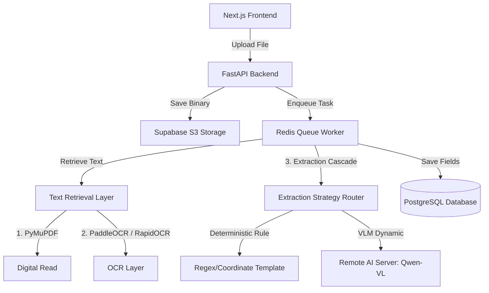
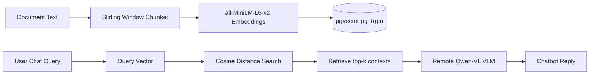
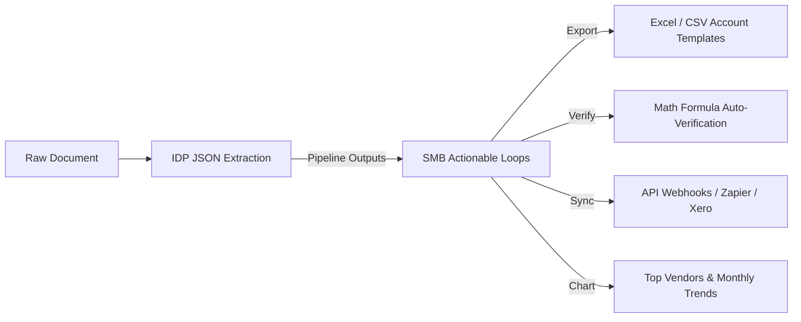

# IDP Feature Expansion Plan: RAG Chatbot & SMB Value Loops

This document provides a detailed design, technical specifications, and architectural roadmap for extending the Intelligent Document Processing (IDP) platform. It outlines the integration of a **Retrieval-Augmented Generation (RAG) Chatbot** and **Small-to-Medium Business (SMB) operational utilities** while maximizing resource reuse.


# Issues and Solutions with the Spreadsheet Feature

## 1. System Context & Current Architecture

To understand how new features integrate, here is a detailed breakdown of the current system's core capabilities:



### 1.1 Backend Technology Stack
* **Web Server**: `FastAPI` (Python) serving REST APIs. Row Level Security (RLS) is enforced via PostgreSQL tenant scopes.
* **Database**: `PostgreSQL` (Supabase managed), using SQLAlchemy as the ORM and Alembic for schema migrations.
* **Background Processing**: Redis Queue (`rq`) worker processes executing long-running extraction and file ingestion tasks.
* **AI Processing Server**: A standalone remote FastAPI server running PaddlePaddle (specifically `PP-DocLayoutV3` for layout analysis and OCR) and Qwen (the remote VLM model for dynamic extraction).

### 1.2 Ingestion & Extraction Workflow
1. **Ingestion**: A user uploads a document. The file is uploaded to Supabase Storage, and a background task is enqueued in Redis Queue.
2. **Text Extraction**: The system checks if the document has a digital text layer using `PyMuPDF`. If not, it executes OCR using GPU-based remote `PaddleOCR` (with a local `RapidOCR` fallback).
3. **Structured Mapping**:
   * *Deterministic Cascade*: It matches the document against predefined templates by template coordinates/keys.
   * *VLM Fallback*: If coordinates do not match, it calls the remote Qwen-VL model with a dynamic JSON schema parameter to parse the document structured output.
   * *Manual Correction*: Users inspect the extracted structured JSON payload in the Next.js interface and can manually override values, which updates the database.

---

## 2. Dynamic RAG & Chatbot System (Minimal Setup)

We will implement a secure, multi-tenant RAG (Retrieval-Augmented Generation) chatbot by expanding our existing PostgreSQL database and remote VLM pipeline without adding heavy or expensive infrastructure.

### 2.1 Technical Strategy (Reusing Resources)



1. **Vector Storage (Postgres + pgvector)**:
   We will leverage the existing Supabase PostgreSQL instance. Supabase has native support for `pgvector`, eliminating the need for a separate vector database (like Pinecone or Qdrant).
2. **Local Embedding Computation**:
   Instead of calling expensive third-party APIs (like OpenAI), we will load a lightweight, highly efficient sentence-transformers model (e.g., `all-MiniLM-L6-v2`, 384 dimensions) directly on the background `rq` worker.
3. **VLM Generation Reuse**:
   The retrieved context will be passed directly into our existing remote VLM (`Qwen-VL`), which is already deployed and pre-loaded on startup, ensuring zero additional LLM hosting costs.

### 2.2 Database Schema Extensions

We will run a new Alembic migration to add a `document_chunks` table, isolated under the same Row Level Security (RLS) tenant keys:

```sql
-- Enable vector extension
CREATE EXTENSION IF NOT EXISTS vector;

CREATE TABLE document_chunks (
    id UUID PRIMARY KEY DEFAULT gen_random_uuid(),
    document_id UUID NOT NULL REFERENCES documents(id) ON DELETE CASCADE,
    tenant_id UUID NOT NULL REFERENCES tenants(id) ON DELETE CASCADE,
    content TEXT NOT NULL,
    chunk_index INT NOT NULL,
    embedding vector(384) NOT NULL
);

-- HNSW index for sub-millisecond similarity search
CREATE INDEX ON document_chunks USING hnsw (embedding vector_cosine_ops);
```

### 2.3 Implementation Details

#### Step 1: Ingestion Embedding Task (rq Job)
Immediately after text extraction (`doc.extracted_text`) completes in `jobs.py`, we enqueue an embedding job:

```python
# backend/app/modules/idp/jobs.py
def index_document_embeddings(db: Session, doc_id: uuid.UUID):
    doc = db.get(Document, doc_id)
    if not doc or not doc.extracted_text:
        return
    
    # 1. Slide window chunking (500 chars, 100 overlap)
    text = doc.extracted_text
    chunks = []
    size, overlap = 500, 100
    for i in range(0, len(text), size - overlap):
        chunks.append(text[i:i + size])
        
    # 2. Compute embeddings (SentenceTransformer)
    from sentence_transformers import SentenceTransformer
    model = SentenceTransformer("all-MiniLM-L6-v2")
    embeddings = model.encode(chunks)
    
    # 3. Save chunks to db
    for idx, (chunk, vector) in enumerate(zip(chunks, embeddings)):
        db.add(DocumentChunk(
            document_id=doc.id,
            tenant_id=doc.tenant_id,
            content=chunk,
            chunk_index=idx,
            embedding=vector.tolist()
        ))
    db.commit()
```

#### Step 2: Context Retrieval API
We define a vector search route in `backend/app/modules/search/service.py`:

```python
def retrieve_relevant_contexts(db: Session, tenant_id: uuid.UUID, query: str, doc_id: uuid.UUID | None = None, limit: int = 5):
    from sentence_transformers import SentenceTransformer
    model = SentenceTransformer("all-MiniLM-L6-v2")
    query_vector = model.encode(query).tolist()
    
    # Cosine distance search <= 1.0 (ordered by similarity)
    stmt = select(DocumentChunk).where(DocumentChunk.tenant_id == tenant_id)
    if doc_id:
        stmt = stmt.where(DocumentChunk.document_id == doc_id)
        
    stmt = stmt.order_by(DocumentChunk.embedding.cosine_distance(query_vector)).limit(limit)
    return db.scalars(stmt).all()
```

#### Step 3: Prompting the VLM
We bundle the context and call the remote VLM:

```python
def generate_chat_response(db: Session, tenant_id: uuid.UUID, doc_id: uuid.UUID | None, user_query: str) -> str:
    chunks = retrieve_relevant_contexts(db, tenant_id, user_query, doc_id)
    context = "\n---\n".join([chunk.content for chunk in chunks])
    
    prompt = f"""
    You are an intelligent document archivist assistant.
    Context from the uploaded documents:
    {context}
    
    User Question: {user_query}
    
    Instructions: Answer the question clearly and accurately using the context above. If the context does not contain the answer, say "I cannot find the answer in the provided documents."
    """
    
    # Call our existing Qwen remote VLM
    response = call_remote_qwen_vlm(prompt)
    return response
```

---

## 3. SMB Target Strategy & Information Extraction Value Loops

Small and Medium Businesses (SMBs) often struggle with operational data transfer. Many do not need semantic chat queries (RAG); instead, they need **tools to automate bookkeeping, tax calculation, and financial verification**.



### 3.1 Key SMB Features & Implementations

| Feature | SMB Pain Point Solved | Implementation Strategy |
| :--- | :--- | :--- |
| **QuickBooks / Xero CSV Export** | Bookkeepers manually copy-pasting numbers from invoices into accounting ledgers. | Generate customized CSV/Excel downloads matching QBO/Xero ingestion formats dynamically from `extracted_data`. |
| **Automated Math Audit** | Missing calculation errors in supplier bills resulting in overpayment or tax filing errors. | Backend validation comparison: flags documents where `subtotal + tax != grand_total` in a visual audit badge. |
| **API Webhooks (Make/Zapier)** | Delayed sync of document info with local inventory and CRM databases. | Provide a webhook configuration panel in settings. Post the validated JSON payload on `STATUS_COMPLETED`. |
| **Spend Analytics Dashboard** | Small business owners lack visibility into cash flow and vendor allocation. | Execute simple SQL aggregations on `extracted_data` fields to build expense tables and charts. |

### 3.2 Dynamic Spreadsheet Export Engine
Instead of just displaying the JSON fields in the browser, we will create a bulk export handler:

```python
# backend/app/modules/files/router.py
@router.post("/export/accounting")
def export_accounting_sheet(db: Session, doc_ids: list[uuid.UUID], format: str = "xero", user = Depends(get_current_user)):
    docs = db.scalars(select(Document).where(Document.id.in_(doc_ids), Document.tenant_id == user.tenant_id)).all()
    
    # Map extracted JSON fields dynamically
    rows = []
    for doc in docs:
        data = doc.extracted_data or {}
        if format == "xero":
            rows.append({
                "ContactName": data.get("vendor_name") or data.get("vendor", ""),
                "EmailAddress": data.get("customer_email") or "",
                "InvoiceNumber": data.get("invoice_no") or data.get("document_id") or doc.filename,
                "InvoiceDate": data.get("date") or data.get("invoice_date") or doc.document_date,
                "DueDate": data.get("due_date") or "",
                "SubTotal": data.get("subtotal") or data.get("grand_total"),
                "Total": data.get("grand_total")
            })
            
    # Compile to CSV/Excel stream using pandas
    import pandas as pd
    df = pd.DataFrame(rows)
    stream = io.StringIO()
    df.to_csv(stream, index=False)
    return StreamingResponse(
        iter([stream.getvalue()]), 
        media_type="text/csv", 
        headers={"Content-Disposition": "attachment; filename=xero_invoice_export.csv"}
    )
```

### 3.3 Visual Math Auditor Badge (Verification Loop)
We can run mathematical verification checks right inside the frontend details panel to alert bookkeepers of calculation discrepancies:

```typescript
// frontend/app/(app)/documents/[id]/page.tsx
function verifyInvoiceMath(extractedData: any): { isOk: boolean; error?: string } {
  if (!extractedData) return { isOk: true };
  
  const parseNum = (val: any) => {
    if (typeof val === "number") return val;
    if (typeof val === "string") return parseFloat(val.replace(/[^0-9.]/g, ""));
    return 0;
  };
  
  const subtotal = parseNum(extractedData.subtotal || extractedData.subtotal_amount);
  const tax = parseNum(extractedData.tax || extractedData.tax_amount);
  const grandTotal = parseNum(extractedData.grand_total || extractedData.total_amount);
  const arrangementFee = parseNum(extractedData.arrangement_fee || 0);
  
  if (subtotal > 0 && grandTotal > 0) {
    const expected = subtotal + tax + arrangementFee;
    // Account for floating point rounding
    if (Math.abs(expected - grandTotal) > 0.05) {
      return { 
        isOk: false, 
        error: `Math mismatch: Subtotal (${subtotal}) + Tax (${tax}) + Fees (${arrangementFee}) = ${expected.toFixed(2)}, but Grand Total is ${grandTotal.toFixed(2)}` 
      };
    }
  }
  return { isOk: true };
}
```
* **UI Integration**: If `isOk` is false, render an amber warning banner at the top of the details panel. This gives users immediate validation feedback.

---

## 4. Phase-1 Beta Testing & Feature Discovery Plan

To gather user feedback and discover high-value feature requirements during the beta phase, we will implement the following strategies:

1. **User Usage Analytics & Event Tracking**:
   * Add telemetry hooks inside [activity_event.py](file:///c:/Users/pnala/Desktop/IDP_Archive/idp_codebase/Digital_Archive_Research/backend/app/models/activity_event.py) to track when users download spreadsheets, correct VLM extraction outputs, or invoke search features.
   * Review which custom templates are most frequently created, helping identify what layouts we should support out-of-the-box.
2. **In-App Feedback Prompting**:
   * Add a micro-feedback loop inside Next.js (e.g., a simple thumb-up/down next to the VLM badge and correction interface) asking: *"Did the system extract this correctly?"*.
3. **Iterative Feature Rollout**:
   * Launch with the accounting export template feature first to gauge bookkeeper engagement.
   * If usage analytics show high download rates, expand accounting integrations from simple CSV exports to direct API integrations (like OAuth sync with QuickBooks/Xero accounts).


---


Viewed feature_planning_01.md:3-28

Let me check the actual extraction output structure first.

Searched for "extracted_data"
Searched for "line_items"
Viewed extract.py:80-130

Good — I now have a clear picture of the data model. Here's the full breakdown.

---

## Issues & Challenges with the Spreadsheet Feature

### The Root Problem: Two Completely Different Output Shapes

Your system produces **two fundamentally different JSON structures** from two pipelines:

**Deterministic path** → `ExtractionCandidate.to_fields()` → fixed camelCase keys:
```json
{ "vendor": "...", "invoiceNumber": "...", "totalAmount": 123.0, "lineItems": [...] }
```

**VLM (Qwen-VL) path** → free-form dict → snake_case keys defined by whatever the prompt/template schema says:
```json
{ "vendor_name": "...", "invoice_no": "...", "grand_total": "$ 123.00", "line_items": [...] }
```

The **same document type** can have `"vendor"` (deterministic) or `"vendor_name"` (VLM). Same doc type, different keys. This is the root of every downstream problem.

---

### Issue List

| # | Issue | Impact |
|---|---|---|
| **1** | **Inconsistent key naming** (`vendor` vs `vendor_name` vs `supplier`) | Column picker shows 3 separate columns for the same concept. Aggregations break. |
| **2** | **Mixed value types** (`"$ 123.00"` string vs `123.0` float for the same field) | Sorting, summing, and filtering on amount columns silently fails or produces wrong results |
| **3** | **Nested arrays in `line_items`** | A row-based spreadsheet can't represent `line_items: [{...}, {...}]` — what do you show in one cell? |
| **4** | **Sub-items nesting** (the JSON you showed earlier with `parent_item` + `sub_items`) | Even harder to flatten — 2 levels deep, sometimes 3 |
| **5** | **Null vs empty string vs missing key** | `data.get("vendor")` returns `None` on VLM docs, `""` on failed deterministic, missing key on old documents |
| **6** | **`camelCase` vs `snake_case`** mix | `lineItems` (deterministic) vs `line_items` (VLM) — different keys, same concept |
| **7** | **No canonical schema across document types** | An invoice and a receipt have different fields entirely. A single spreadsheet view can't cover both cleanly |
| **8** | **JSONB aggregation performance** | `SELECT extracted_data->>'vendor_name' FROM documents WHERE ...` requires full JSONB scan — no index benefit on arbitrary key access |

---

## What to Actually Build: Simple, Safe, Quick

### Step 1 — Alias Map (1 day, zero risk)

A single Python dict that normalises keys *at read time* — no DB migration, no schema change.

```python
# backend/app/modules/files/normalise.py

FIELD_ALIASES = {
    # Vendor
    "vendor_name": "vendor",
    "supplier": "vendor",
    "company_name": "vendor",
    # Invoice number
    "invoice_no": "invoiceNumber",
    "invoice_number": "invoiceNumber",
    "doc_number": "invoiceNumber",
    # Total
    "grand_total": "totalAmount",
    "total_amount": "totalAmount",
    "total": "totalAmount",
    "amount_due": "totalAmount",
    # Date
    "invoice_date": "invoiceDate",
    "date": "invoiceDate",
    "document_date": "invoiceDate",
    # Line items
    "line_items": "lineItems",
}

def normalise_extracted(data: dict) -> dict:
    """Remap known aliases to canonical keys. Preserves unknown keys as-is."""
    if not data:
        return {}
    out = {}
    for k, v in data.items():
        canonical = FIELD_ALIASES.get(k, k)
        out[canonical] = v
    return out
```

Call this in the export endpoint before processing. **No DB write, no migration, zero risk.** Existing data is untouched.

---

### Step 2 — Currency String → Float Normaliser (2 hours)

```python
import re

def parse_amount(val) -> float | None:
    if val is None:
        return None
    if isinstance(val, (int, float)):
        return float(val)
    if isinstance(val, str):
        cleaned = re.sub(r"[^\d.]", "", val)
        try:
            return float(cleaned)
        except ValueError:
            return None
    return None
```

Apply this to any column the user selects that looks like a numeric/amount field. Enables real sorting and summing.

---

### Step 3 — Line Items: Two Export Modes (1 day)

Line items can't live in a summary row. Give users a **toggle**:

**Mode A — Summary View** (default):
Each document = one row. `line_items` is collapsed to a count or comma-joined description string.

```
| Vendor     | Invoice No | Total  | Items        |
| Acme Corp  | INV-001    | $500   | 3 items      |
```

**Mode B — Expanded View** (one row per line item):
Each line item = one row. Header fields (`vendor`, `invoice_no`) repeat on each row.

```
| Vendor     | Invoice No | Item Description   | Qty | Unit Price | Amount |
| Acme Corp  | INV-001    | Bridal Bouquet     | 1   | $250       | $250   |
| Acme Corp  | INV-001    | Church Flowers     | 1   | $150       | $150   |
```

This is a simple flatten operation — no complex logic:

```python
def flatten_to_rows(doc, data: dict, mode: str) -> list[dict]:
    base = {
        "filename": doc.original_filename,
        "vendor": data.get("vendor"),
        "invoiceNumber": data.get("invoiceNumber"),
        "totalAmount": parse_amount(data.get("totalAmount")),
        "invoiceDate": data.get("invoiceDate"),
    }
    if mode == "summary":
        items = data.get("lineItems") or []
        base["item_count"] = len(items)
        return [base]
    elif mode == "expanded":
        items = data.get("lineItems") or []
        if not items:
            return [base]
        rows = []
        for item in items:
            row = {**base}
            row["item_description"] = item.get("description") or item.get("parent_item_description")
            row["item_qty"] = item.get("quantity") or item.get("parent_quantity")
            row["item_amount"] = parse_amount(item.get("amount") or item.get("parent_total_amount"))
            rows.append(row)
        return rows
```

---

### Step 4 — Column Discovery API (half day)

Instead of hardcoding column names, dynamically discover what keys exist in the tenant's data:

```python
# Returns all top-level keys present in this tenant's extracted_data
SELECT DISTINCT jsonb_object_keys(extracted_data) AS field_key
FROM documents
WHERE tenant_id = :tid AND extracted_data IS NOT NULL
```

Frontend fetches this once → builds the column picker checkbox list dynamically. No code change needed when new document types are added.

---

### Step 5 — The UI: Spreadsheet Center (2-3 days)

Simple page layout — nothing fancy needed on the backend side:

```
┌─────────────────────────────────────────────────────────┐
│ SPREADSHEET CENTER                                      │
├──────────────┬──────────────────────────────────────────┤
│ COLUMNS      │ FILTERS                                  │
│ ☑ vendor     │ Date: [Apr 1] to [Jun 30]               │
│ ☑ invoiceNo  │ Type: [Invoice ▾]                       │
│ ☑ totalAmt   │ Status: [Completed ▾]                   │
│ ☐ currency   │                                         │
│ ☐ dueDate    │ View: ○ Summary  ● Expanded             │
│ ── line items ──────────────────│                      │
│ ☑ item_desc  │    [Preview Table]  [Export CSV] [XLSX] │
│ ☑ item_amt   │                                         │
└──────────────┴──────────────────────────────────────────┘
```

---

### What NOT to Do Now

- **No materialised columns migration** — the alias map + runtime normalisation is good enough for the beta phase. Add proper materialised columns only when analytics query performance becomes a real bottleneck.
- **No saved preset UI** — ship the basic column picker first. Add "Save as template" once users show they actually reuse the same selections.
- **No sub-item nesting in the spreadsheet** — flatten only one level (parent items). Sub-items go into a note/detail column as a string if needed.

---

### Implementation Order (Quickest Value First)

```
Day 1: normalise.py alias map + parse_amount util
Day 2: /export/available-fields API + /export/spreadsheet API (summary mode)
Day 3: Frontend Spreadsheet Center page (column picker + filter bar + CSV download)
Day 4: Add expanded mode (line item flattening) + XLSX output
```
