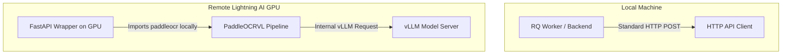

# Plan: Decoupling PaddleOCR-VL Client Orchestration to Lightning AI

This plan outlines the architecture and implementation details for offloading the `paddleocr` library orchestration entirely to a remote GPU environment (e.g., your Lightning AI Studio). This eliminates the need to install or run compile-heavy machine learning libraries (`paddlepaddle`, `paddleocr`, PyTorch, CUDA, etc.) on local developer workstations or lightweight backend containers.

---

## 1. Architecture Overview

### Current Architecture
Currently, the local python backend requires importing `paddleocr` to instantiate the `PaddleOCRVL` class, which manages formatting images and calling the remote model.
```mermaid
graph TD
    subgraph Local Machine
        Worker[RQ Worker / Backend] -- Imports paddleocr --Locally--> Client[PaddleOCRVL Client]
    end
    subgraph Remote Lightning AI GPU
        Client -- HTTP API Request --> VLLM[vLLM Model Server]
    end
```

### Proposed Target Architecture
The entire orchestration moves to a lightweight API wrapper running directly on the GPU machine. The local backend only needs standard HTTP client calls.


---

## 2. Remote Component: FastAPI Service on Lightning AI

We will deploy a standalone, lightweight FastAPI microservice on the Lightning AI GPU environment. It will accept the uploaded image, execute `PaddleOCRVL` locally (on the GPU), and return clean OCR texts.

### File: `remote_paddle_server.py`
This file will be uploaded and run on your Lightning AI Studio:

```python
import os
import tempfile
import logging
from fastapi import FastAPI, UploadFile, File, HTTPException
from fastapi.responses import JSONResponse

logging.basicConfig(level=logging.INFO)
logger = logging.getLogger("remote-paddle-ocr")

app = FastAPI(
    title="Remote PaddleOCR-VL API", 
    description="Exposes PaddleOCRVL layout parsing as an API"
)

# Pipeline lazy load to allow server to boot instantly
pipeline = None

def get_pipeline():
    global pipeline
    if pipeline is None:
        from paddleocr import PaddleOCRVL
        logger.info("Initializing PaddleOCRVL pipeline on GPU...")
        pipeline = PaddleOCRVL(
            vl_rec_backend="vllm-server",
            vl_rec_server_url="http://localhost:8000/v1",  # Local port inside Lightning Studio
            vl_rec_api_model_name="PaddlePaddle/PaddleOCR-VL"
        )
        logger.info("PaddleOCRVL pipeline successfully initialized.")
    return pipeline

@app.get("/health")
def health():
    return {"status": "ok", "message": "Remote PaddleOCR-VL microservice is ready"}

@app.post("/v1/predict")
async def predict(file: UploadFile = File(...)):
    """Receives document image, runs OCR parsing on GPU, and returns layout text."""
    logger.info("Received prediction request for file: %s", file.filename)
    
    # Save the uploaded file to a temporary location
    suffix = os.path.splitext(file.filename)[1]
    with tempfile.NamedTemporaryFile(delete=False, suffix=suffix) as tmp:
        try:
            content = await file.read()
            tmp.write(content)
            tmp_path = tmp.name
        except Exception as e:
            logger.error("Failed to write uploaded file: %s", e)
            raise HTTPException(status_code=400, detail=f"Failed to process upload: {e}")

    try:
        # Run inference using the GPU pipeline
        vl_pipeline = get_pipeline()
        logger.info("Running PaddleOCRVL prediction...")
        results = vl_pipeline.predict(tmp_path)
        
        # Parse output structure
        combined_content = []
        if isinstance(results, list) and results:
            # Check for parsing result list (typical structure of PaddleOCRVL return value)
            if 'parsing_res_list' in results[0]:
                for item in results[0]['parsing_res_list']:
                    content_str = item.get('content') if isinstance(item, dict) else getattr(item, 'content', None)
                    if content_str:
                        combined_content.append(content_str)
        
        extracted_text = "\n".join(combined_content)
        logger.info("Prediction successful. Extracted %d chars.", len(extracted_text))
        
        return JSONResponse(content={
            "status": "success",
            "text": extracted_text
        })
        
    except Exception as e:
        logger.exception("Error during prediction execution: %s", e)
        return JSONResponse(status_code=500, content={
            "status": "error",
            "detail": str(e)
        })
        
    finally:
        # Cleanup temporary files
        if os.path.exists(tmp_path):
            try:
                os.unlink(tmp_path)
            except Exception as e:
                logger.warning("Failed to clean up temp file %s: %s", tmp_path, e)

if __name__ == "__main__":
    import uvicorn
    # Start on port 8002 (or any port exposed by your Lightning Studio)
    uvicorn.run(app, host="0.0.0.0", port=8002)
```

---

## 3. Local Component Changes (On Your Machine)

We will remove the local dependencies of `paddleocr` and make the pipeline route through REST API calls.

### File 1: [paddle_qwen.py](file:///c:/Users/pnala/Desktop/IDP_Archive/idp_codebase/Digital_Archive_Research/backend/app/modules/idp/paddle_qwen.py)
We will rewrite `paddle_qwen.py` to completely eliminate local imports and instead issue HTTP POST requests:

```python
import os
import re
import json
import logging
from typing import Tuple, Dict, Any
import httpx
from bs4 import BeautifulSoup

from app.core.config import settings

logger = logging.getLogger(__name__)

# Note: We completely remove _get_paddle_pipeline() and native paddleocr imports

def run_paddle_ocr_prediction(image_path: str) -> str:
    """Predicts OCR text on an image by executing a REST POST to the remote GPU server.
    
    Falls back gracefully to a Mock prediction if the remote URL is a localhost default,
    offline, or during testing.
    """
    
    # 1. Check if mock mode is appropriate
    is_localhost = "localhost" in settings.paddle_ocr_url or "127.0.0.1" in settings.paddle_ocr_url
    if is_localhost and settings.env == "development":
        logger.info("[MOCK] Running mock PaddleOCRVL local fallback.")
        return """
        Invoice
        Vendor: ACME Corp Ltd
        Address: 123 Industrial Way, Tech City
        Client: DataWiz Corp
        Date: 2026-06-22
        Invoice Number: INV-2026-PADDLE
        
        <table>
            <tr>
                <th>description</th>
                <th>quantity</th>
                <th>unit_price</th>
                <th>line_total</th>
            </tr>
            <tr>
                <td>Server Hosting (AWS)</td>
                <td>1</td>
                <td>800.00</td>
                <td>800.00</td>
            </tr>
            <tr>
                <td>Database Support Services</td>
                <td>1</td>
                <td>150.00</td>
                <td>150.00</td>
            </tr>
        </table>
        
        Subtotal: 950.00
        Tax Amount: 50.00
        Total Amount: 1000.00
        """

    # 2. Call the Remote GPU API endpoint
    url = f"{settings.paddle_ocr_url}/v1/predict"
    logger.info("Calling remote PaddleOCR-VL API: %s", url)
    
    try:
        with open(image_path, "rb") as f:
            files = {"file": (os.path.basename(image_path), f, "image/png")}
            # 120s timeout to allow remote model warm-up
            response = httpx.post(url, files=files, timeout=120.0)
            
        response.raise_for_status()
        result_data = response.json()
        
        if result_data.get("status") == "success":
            return result_data["text"]
        else:
            detail = result_data.get("detail", "Unknown remote execution error")
            raise RuntimeError(f"Remote server failed execution: {detail}")
            
    except Exception as e:
        logger.exception("Failed to contact or execute remote PaddleOCR-VL API: %s", e)
        # Graceful fallback or propagation
        raise RuntimeError(f"OCR Prediction failed: {e}")
```

### File 2: [backend/.env](file:///c:/Users/pnala/Desktop/IDP_Archive/idp_codebase/Digital_Archive_Research/backend/.env)
Add the target port 8002 Cloudspace URL to point to the new FastAPI service:
```env
# ==== Remote PaddleOCR-VL Service ====
# Replace with the actual URL exposed by your Lightning AI Studio port 8002
PADDLE_OCR_URL=https://8002-01ktwv34p98sx3n9n7crzkyezh.cloudspaces.litng.ai
```

---

## 4. Tomorrow's Verification Steps

When we meet tomorrow, we will run through these verification steps to ensure everything works perfectly:

1. **Deploy Python Script to Lightning AI**:
   - Access the Lightning AI GPU environment.
   - Create a file `remote_paddle_server.py` with the code above.
   - Run the server: `python remote_paddle_server.py`.
   - Expose the HTTP Port `8002`.
2. **Update Environment Variables**:
   - Set the `PADDLE_OCR_URL` inside your local [backend/.env](file:///c:/Users/pnala/Desktop/IDP_Archive/idp_codebase/Digital_Archive_Research/backend/.env) to point to the newly exposed endpoint.
3. **Execute Backend Test Suite**:
   - Run local unit tests to verify the mock/integration pipeline is completely intact:
     ```bash
     cd backend
     pytest app/tests/test_paddle_qwen.py
     ```
4. **End-to-End Document Upload Verification**:
   - Fire up the Next.js frontend, select `"paddle_qwen"` in the IDP Control Center UI.
   - Upload a test invoice document, and watch the local worker dispatch the image file to your remote Lightning AI GPU and return the extracted values.
